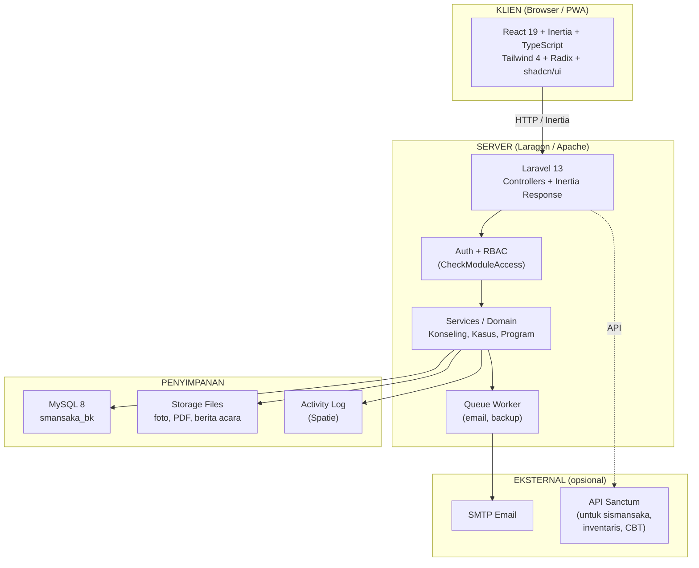
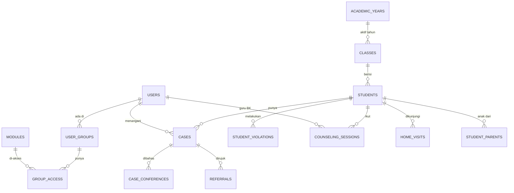

# Buku Pertama

## Rancangan Aplikasi Bimbingan & Konseling SMANSAKA
### beserta Stack Teknologi yang Digunakan

*Dokumen panduan untuk guru, tim pengembang, dan siapa pun yang ingin
memahami aplikasi BK SMANSAKA dari dasar.*

---

**Disusun oleh:** Tim Pengembang SMANSAKA
**Sekolah:** SMA Negeri 1 Kabanjahe
**Tanggal:** 22 April 2026
**Versi:** 1.0

---

## Daftar Isi

1. [Pengantar](#1-pengantar)
2. [Tujuan & Sasaran](#2-tujuan--sasaran)
3. [Ruang Lingkup Aplikasi](#3-ruang-lingkup-aplikasi)
4. [Daftar Modul Aplikasi](#4-daftar-modul-aplikasi)
5. [Peran Pengguna & Hak Akses](#5-peran-pengguna--hak-akses)
6. [Arsitektur Sistem](#6-arsitektur-sistem)
7. [Stack Teknologi & Alasan Pemilihan](#7-stack-teknologi--alasan-pemilihan)
8. [Gambaran Struktur Database](#8-gambaran-struktur-database)
9. [Desain Antarmuka](#9-desain-antarmuka)
10. [Keamanan & Kerahasiaan Klien](#10-keamanan--kerahasiaan-klien)
11. [Integrasi dengan Ekosistem SMANSAKA](#11-integrasi-dengan-ekosistem-smansaka)
12. [Rencana Pengembangan Bertahap](#12-rencana-pengembangan-bertahap)
13. [Glossarium](#13-glossarium)
14. [Referensi](#14-referensi)

---

## 1. Pengantar

### 1.1 Latar Belakang

Bimbingan dan Konseling (BK) adalah bagian tidak terpisahkan dari pendidikan di SMA.
Tiga guru BK di SMAN 1 Kabanjahe selama ini menjalankan tugas **bimbingan, konseling,
layanan administratif, dan pelaporan** dengan mengandalkan buku catatan manual,
berkas kertas, dan file Excel/Word yang tersebar.

Kondisi ini menimbulkan beberapa masalah:

- **Data tersebar**, sulit dicari saat dibutuhkan (mis. mencari riwayat kasus seorang siswa).
- **Laporan memakan waktu lama** karena harus merangkum dari berkas manual.
- **Kerahasiaan klien** kurang terjamin karena berkas fisik bisa dibaca siapa saja.
- **Tidak ada tren/analitik** yang bisa dipakai untuk evaluasi program.

Aplikasi ini hadir sebagai solusi: sebuah **sistem informasi BK profesional berbasis web**
yang aman, modern, dan sesuai standar POP BK Kemendikbud.

### 1.2 Nama & Singkatan

- **Nama resmi:** Sistem Informasi Bimbingan & Konseling SMANSAKA
- **Nama kode:** `smansaka-bk`
- **URL lokal:** `http://smansaka-bk.test` (via Laragon)

### 1.3 Siapa yang Akan Memakai?

- **Guru BK** (3 orang) — pengguna utama, input layanan harian.
- **Koordinator BK** — supervisi, laporan, program tahunan.
- **Wali Kelas** — melihat data publik siswa di kelasnya.
- **Kepala Sekolah** — dashboard & laporan tingkat sekolah.
- **Super Admin / Operator** — kelola user, backup, pengaturan.
- **Siswa & Orang Tua** (fase akhir) — portal terpisah.

---

## 2. Tujuan & Sasaran

### 2.1 Tujuan

1. **Memusatkan** data siswa asuh, kasus, layanan, dan program BK dalam satu sistem.
2. **Menjaga kerahasiaan** catatan konseling sesuai asas BK.
3. **Mempercepat pembuatan laporan** bulanan/semester/tahunan.
4. **Memberi dasar data** (bukan asumsi) untuk penyusunan program BK melalui AKPD/DCM.
5. **Menyediakan dashboard analitik** untuk evaluasi & perbaikan layanan.

### 2.2 Sasaran Terukur

| # | Sasaran | Indikator |
|---|---------|-----------|
| 1 | 100% siswa tercatat dalam sistem | Total siswa = jumlah aktif di Dapodik |
| 2 | Semua kasus tercatat digital | Tidak ada lagi buku kasus manual setelah go-live |
| 3 | Laporan bulanan < 10 menit | Dari data yang sudah terinput, laporan jadi otomatis |
| 4 | Audit log 100% aksi sensitif | Setiap akses catatan rahasia tercatat |
| 5 | Responsif di HP guru BK | Lulus Lighthouse PWA score ≥ 90 |

---

## 3. Ruang Lingkup Aplikasi

### 3.1 Kebutuhan Fungsional

Apa yang **harus bisa dikerjakan** oleh aplikasi:

- ✅ Manajemen data siswa (CRUD, import Excel, integrasi sismansaka)
- ✅ Pencatatan kasus siswa (akademik, pribadi, sosial, karier, pelanggaran)
- ✅ Pencatatan sesi konseling (individual, kelompok, klasikal)
- ✅ Home visit + tanda tangan digital + berita acara PDF
- ✅ Poin pelanggaran dengan escalation otomatis (SP1/2/3)
- ✅ Konferensi kasus + notulen + tanda tangan
- ✅ Referral ke pihak eksternal + surat rujukan
- ✅ Instrumen AKPD, DCM, Sosiometri, Minat Bakat
- ✅ Penyusunan RPL BK, Program Tahunan & Semesteran
- ✅ Laporan bulanan/semester/tahunan (PDF/Excel)
- ✅ Dashboard analitik
- ✅ Notifikasi email (panggilan ortu, undangan konferensi)

### 3.2 Kebutuhan Non-Fungsional

Bagaimana aplikasi **harus berperilaku**:

| Aspek | Target |
|-------|--------|
| **Kerahasiaan** | Catatan konseling hanya bisa dibaca guru BK penangani + Koordinator |
| **Audit Trail** | Setiap akses data sensitif tercatat (siapa, kapan, IP) |
| **Performa** | Halaman load < 2 detik di jaringan sekolah |
| **Responsif** | Berfungsi baik di HP, tablet, desktop |
| **PWA** | Bisa di-install di HP, bekerja offline (terbatas) |
| **Backup** | Otomatis harian ke folder `storage/app/backups/` |
| **Keamanan** | HTTPS, bcrypt, CSRF, rate limit login, whitelist upload |
| **Skalabilitas** | Mampu menampung 1.500 siswa + 10 tahun data historis |
| **Maintainability** | Kode terformat otomatis (Pint/Prettier), ada unit test (Pest/Vitest) |

---

## 4. Daftar Modul Aplikasi

Aplikasi ini dibagi menjadi **6 kelompok modul**. Warna menunjukkan fase:

### 4.1 Inti (Fase 1–2)

| Modul | Fungsi |
|-------|--------|
| Dashboard | Ringkasan aktivitas BK hari ini & minggu ini |
| Siswa Asuh | Data siswa + orang tua, import Excel, integrasi sismansaka |
| Kelas & Wali Kelas | Master data kelas |
| Tahun Ajaran | Tahun ajaran aktif |

### 4.2 Layanan BK (Fase 4)

| Modul | Fungsi |
|-------|--------|
| Konseling Individual | Log sesi per siswa (**RAHASIA**) |
| Konseling Kelompok | Sesi + peserta + topik |
| Bimbingan Klasikal | Masuk kelas dengan RPL BK |
| Home Visit | Kunjungan rumah + tanda tangan + foto |

### 4.3 Kasus & Pelanggaran (Fase 3)

| Modul | Fungsi |
|-------|--------|
| Buku Kasus | Catatan kasus multi-kategori |
| Poin Pelanggaran | Akumulasi + escalation otomatis |
| Konferensi Kasus | Rapat multi-pihak + notulen |
| Referral | Rujukan ke psikolog/puskesmas |

### 4.4 Instrumen BK (Fase 5)

| Modul | Fungsi |
|-------|--------|
| AKPD | Angket Kebutuhan Peserta Didik |
| DCM | Daftar Cek Masalah (±240 butir) |
| Sosiometri | Pemetaan hubungan sosial kelas (diagram interaktif) |
| Minat Bakat / Karier | RIASEC / Holland — rekomendasi jurusan |

### 4.5 Program BK (Fase 6)

| Modul | Fungsi |
|-------|--------|
| RPL BK | Rencana Pelaksanaan Layanan |
| Program Tahunan | Dihasilkan dari AKPD/DCM |
| Program Semesteran | Turunan program tahunan |

### 4.6 Laporan & Sistem (Fase 6)

| Modul | Fungsi |
|-------|--------|
| Laporan | Laporan bulanan/semester/tahunan (PDF/Excel) |
| Sistem | User, grup, modul, branding, activity log |
| Profil | Profil user login |

---

## 5. Peran Pengguna & Hak Akses

Aplikasi memakai model **RBAC** (Role-Based Access Control). Ada 7 peran:

| Peran | Singkatan | Wewenang |
|-------|-----------|----------|
| Super Admin | SA | Akses penuh, termasuk kelola user/grup/modul |
| Koordinator BK | KBK | Akses penuh modul BK + supervisi |
| Guru BK | GBK | Akses modul BK untuk siswa asuhnya |
| Wali Kelas | WK | Lihat kasus **publik** siswa di kelasnya (BUKAN konseling rahasia) |
| Kepala Sekolah | KS | Read-only untuk laporan & dashboard |
| Siswa | SW | Portal siswa (fase akhir) |
| Orang Tua | OT | Portal orang tua (fase akhir) |

### 5.1 Matriks Akses (ringkas)

| Modul | SA | KBK | GBK | WK | KS |
|-------|:-:|:--:|:--:|:-:|:-:|
| Dashboard | ✅ | ✅ | ✅ | ✅ | ✅ |
| Siswa Asuh | ✅ | ✅ | 👁️ asuhan | 👁️ kelas | 👁️ |
| Konseling Individual | ✅ | ✅ | ✅ miliknya | ❌ | 👁️ ringkas |
| Buku Kasus (publik) | ✅ | ✅ | ✅ | 👁️ | 👁️ |
| Buku Kasus (rahasia) | ✅ | ✅ | ✅ miliknya | ❌ | ❌ |
| Konferensi Kasus | ✅ | ✅ | ✅ | 👁️ undangannya | 👁️ |
| Instrumen | ✅ | ✅ | ✅ | ❌ | 👁️ |
| Program BK | ✅ | ✅ | 👁️ | ❌ | 👁️ |
| Laporan | ✅ | ✅ | 👁️ miliknya | ❌ | 👁️ |
| Sistem | ✅ | ❌ | ❌ | ❌ | ❌ |

Keterangan: ✅ = tulis, 👁️ = baca saja, ❌ = tidak ada akses.

---

## 6. Arsitektur Sistem

### 6.1 Diagram Arsitektur



### 6.2 Alur Request Sederhana

1. Guru BK klik **"Tambah Sesi Konseling"** di browser.
2. React kirim POST via Inertia ke `/counseling/individual`.
3. Laravel middleware `CheckModuleAccess` verifikasi izin.
4. Controller panggil service untuk validasi + simpan ke MySQL.
5. Activity log otomatis mencatat aksi.
6. Response Inertia kembali ke browser → React update UI tanpa reload.
7. Toast Sonner muncul: "Sesi berhasil disimpan".

---

## 7. Stack Teknologi & Alasan Pemilihan

### 7.1 Backend

| Teknologi | Versi | Alasan |
|-----------|:-----:|--------|
| **PHP** | 8.3 | Performance 2× lebih cepat dari PHP 7, typed properties, enums |
| **Laravel** | 13 | Framework PHP paling mature, ekosistem Spatie, dokumentasi lengkap |
| **Inertia.js** | 3 | Menggabungkan kemudahan Laravel-routing dengan modern SPA feel |
| **MySQL** | 8 | Standar Laragon, JSON native, window functions |
| **Spatie ActivityLog** | 4 | Audit trail mature, tidak perlu buat manual |
| **Spatie MediaLibrary** | 11 | Upload file + thumbnail otomatis + polymorphic |
| **barryvdh/laravel-dompdf** | 3 | PDF laporan dari Blade view |
| **maatwebsite/excel** | 3 | Import siswa dari Excel, export laporan |
| **Laravel Sanctum** | 4 | API token untuk integrasi antar aplikasi SMANSAKA |
| **Pest PHP** | 3 | Testing modern, sintaks lebih ringkas dari PHPUnit |
| **Laravel Pint** | 1 | Formatter PHP otomatis (PSR-12) |

### 7.2 Frontend

| Teknologi | Versi | Alasan |
|-----------|:-----:|--------|
| **React** | 19 | Library UI paling populer, ekosistem besar |
| **TypeScript** | 5 | Type safety → bug lebih sedikit |
| **Tailwind CSS** | 4 | Utility-first, compiler 10× lebih cepat dari v3 |
| **Radix UI Primitives** | 1 | Komponen accessible unstyled |
| **shadcn/ui pattern** | — | Komponen tinggal copy ke repo, full kontrol |
| **lucide-react** | latest | 1.400+ ikon modern |
| **@tanstack/react-table** | 8 | Tabel profesional dengan sort/filter/virtualization |
| **react-hook-form** | 7 | Form performance terbaik di React |
| **zod** | 3 | Validation schema, type-safe end-to-end |
| **recharts** | 2 | Chart untuk dashboard analitik |
| **date-fns** | 3 | Format tanggal dengan locale `id` |
| **sonner** | 1 | Toast notification modern, animasi halus |
| **signature_pad** | 4 | Tanda tangan digital di home visit & konferensi |
| **react-force-graph-2d** | 1 | Diagram sosiometri interaktif |
| **Vite** | 8 | Build tool super cepat, HMR instan |

### 7.3 Tooling & Quality Gate

| Tools | Fungsi |
|-------|--------|
| ESLint + Prettier | Formatter & linter JS/TS |
| Laravel Pint | Formatter PHP |
| Husky + lint-staged | Pre-commit hook otomatis |
| Vitest + Testing Library | Unit test React |
| Pest PHP | Unit/feature test Laravel |

### 7.4 Mengapa Stack Ini, Bukan yang Lain?

> **Pertanyaan:** "Kenapa tidak pakai Next.js atau Vue/Nuxt?"

- **Laravel + Inertia** memberi produktivitas maksimal untuk tim kecil:
  tidak perlu buat API terpisah, validation di server, routing di Laravel.
- **Next.js** butuh tim terpisah buat backend API → overkill untuk skala sekolah.
- **Vue** juga bagus, tapi React punya ekosistem komponen BK-friendly lebih kaya
  (TanStack Table, react-force-graph, dll.) dan konsisten dengan
  `smansaka-inventaris` (yang sudah jalan).

> **Pertanyaan:** "Kenapa Tailwind bukan Bootstrap?"

- Tailwind 4 adalah *state-of-the-art* styling di 2026. Bootstrap terlihat
  "seragam" dan sulit di-customize. Tailwind memberi kontrol penuh atas
  visual, sambil tetap cepat karena utility-first.

> **Pertanyaan:** "Kenapa MySQL bukan PostgreSQL?"

- Laragon default MySQL, semua aplikasi SMANSAKA sudah MySQL, jadi
  backup/restore/training seragam.

---

## 8. Gambaran Struktur Database

### 8.1 Relasi Utama (sederhana)



### 8.2 Tabel Kunci

**users** → identitas pengguna (login via `username`).
**students** → data siswa (NIS, NISN, nama, kelas, foto).
**cases** → buku kasus: kategori, status, `is_confidential`, ditangani oleh user_id.
**counseling_sessions** → sesi konseling individual/kelompok.
**activity_log** → audit trail (dari Spatie) — siapa, kapan, aksi apa, IP.

Detail migrasi akan ada di **Buku Kedua: Fondasi (Fase 1)**.

---

## 9. Desain Antarmuka

### 9.1 Palet Warna (teal SMANSAKA)

| Tingkat | Hex | Pemakaian |
|---------|-----|-----------|
| primary-50 | `#eefbfc` | Background lembut |
| primary-100 | `#d5f4f7` | Highlight hover |
| primary-400 | `#3bb8cc` | Ring focus input |
| primary-600 | `#117481` | **Warna utama** (button, link, sidebar) |
| primary-700 | `#145f6b` | Button hover |
| primary-900 | `#19414b` | Teks di atas primary |
| accent-500 | `#db9620` | Badge accent, highlight penting |

### 9.2 Tipografi

- Font utama: **Inter** (dari bunny.net, tidak pakai Google Fonts demi privasi)
- Heading: `font-semibold tracking-tight`
- Body: `text-neutral-700 leading-relaxed`

### 9.3 Layout Utama

```
┌───────────────────────────────────────────────────┐
│ [Logo SMANSAKA] [Tahun Ajaran 2026]   [User ▾]    │  Top bar
├───────────┬───────────────────────────────────────┤
│ SIDEBAR   │                                       │
│           │                                       │
│ Brand     │         KONTEN UTAMA                  │
│ Dashboard │    (Inertia page yang di-render       │
│           │      oleh React komponen)             │
│ Layanan   │                                       │
│ Kasus     │                                       │
│ Instrumen │                                       │
│ Program   │                                       │
│ Laporan   │                                       │
│           │                                       │
│ [Keluar]  │                                       │
└───────────┴───────────────────────────────────────┘
```

### 9.4 Konvensi Komponen

- **Card:** `rounded-2xl bg-white shadow-sm ring-1 ring-neutral-100 p-6`
- **Input:** `rounded-xl border-neutral-200 focus:border-primary-400 focus:ring-primary-100`
- **Primary button:** `rounded-xl bg-primary-600 hover:bg-primary-700 text-white`
- **Badge rahasia:** `bg-danger-50 text-danger-700 ring-1 ring-danger-500/20`
- **Modal konfirmasi:** HeadlessDialog (Radix) — **bukan** `confirm()` browser

---

## 10. Keamanan & Kerahasiaan Klien

### 10.1 Mengapa Ini Bab Paling Penting?

Konseling adalah hubungan kepercayaan antara siswa dan guru BK. **Bocornya catatan
konseling bisa merusak siswa lebih parah daripada masalah aslinya**. Karena itu:

### 10.2 Prinsip Kerahasiaan

1. **Default Confidential** — setiap catatan konseling ditandai rahasia kecuali diubah eksplisit.
2. **Visibility List** — hanya user di `visible_to` yang bisa membaca (guru penangani + Koordinator BK).
3. **Kepala Sekolah bisa baca** hanya jika koordinator membuka flag — dan itu tercatat di audit log.
4. **Wali Kelas TIDAK otomatis** melihat isi sesi konseling. Hanya kasus "publik".
5. **Export PDF** berisi watermark "RAHASIA" jika data konseling ikut dicetak.

### 10.3 Keamanan Teknis

| Ancaman | Mitigasi |
|---------|----------|
| Brute-force login | Rate limit 5× per menit per IP |
| SQL Injection | Eloquent ORM (parameterized), tidak pakai raw query |
| XSS | Escape otomatis di Blade + React (kecuali dangerouslySetInnerHTML — tidak dipakai) |
| CSRF | Token Laravel default di semua form |
| File upload nakal | Whitelist ekstensi (jpg/png/pdf), validasi MIME type, rename saat simpan |
| Password lemah | Minimum 8 karakter + bcrypt 12 rounds |
| Session hijacking | HTTPS only, cookie secure + httpOnly |
| Path traversal | `basename()` saat delete file, storage via Laravel Storage facade |

### 10.4 Audit Log

Setiap aksi terhadap data sensitif dicatat di `activity_log` (Spatie):

| Kolom | Isi |
|-------|-----|
| `log_name` | Nama log (mis. "counseling") |
| `description` | "viewed", "created", "updated", "deleted" |
| `subject_type` | Model yang diakses (mis. `CounselingSession`) |
| `subject_id` | ID-nya |
| `causer_id` | User yang melakukan |
| `properties` | Perubahan (old → new), IP, user agent |
| `created_at` | Waktu |

---

## 11. Integrasi dengan Ekosistem SMANSAKA

### 11.1 Aplikasi Terkait

| Aplikasi | Fungsi | Relasi dengan BK |
|----------|--------|------------------|
| **sismansaka** | Sistem Informasi Sekolah | Sumber data siswa, kelas, ortu (via API) |
| **smansaka-inventaris** | Aset sekolah | Tempat ruang konseling tercatat |
| **smansaka-perpustakaan** | Peminjaman buku | Data peminjaman buku BK |
| **cbtakm-mobile** | Ujian CBT | Nilai untuk analisis kasus akademik |

### 11.2 Rencana Integrasi

- **Fase sekarang:** Import Excel manual + input data langsung.
- **Fase masa depan:** API Sanctum antar aplikasi:
  - `GET /api/students` (di sismansaka) → dipakai oleh BK untuk sync siswa.
  - `POST /api/cases/webhook` (di BK) → dipakai wali kelas kirim laporan kasus dari aplikasinya.
- **Single Sign-On (opsional):** satu login untuk semua aplikasi SMANSAKA (paling akhir).

---

## 12. Rencana Pengembangan Bertahap

### Fase 1 — Fondasi (estimasi 1–2 hari)

- Scaffold Laravel 13 + Inertia + React 19 + TS + Tailwind 4 + Vite 8
- Database + migrasi inti (users, groups, modules, settings, academic_years)
- Auth (login/logout) + RBAC `CheckModuleAccess`
- Layout (sidebar, login split, dashboard placeholder)
- Seeder (admin, modules, groups, tahun ajaran)
- Komponen shadcn (Button, Input, Dialog, Dropdown, Toast)
- PWA manifest + service worker
- Quality gate (Pint, ESLint, Prettier, Husky)

### Fase 2 — Master Data (1–2 hari)

- CRUD siswa + import Excel + link ke sismansaka (stub)
- CRUD kelas + wali kelas + orang tua + guru BK
- Assignment siswa asuh ke guru BK

### Fase 3 — Buku Kasus & Pelanggaran (2 hari)

- CRUD kasus dengan workflow (baru → penanganan → selesai → rujukan)
- Poin pelanggaran + escalation otomatis (SP1/2/3)
- Notifikasi email ke wali kelas & ortu

### Fase 4 — Layanan BK (2–3 hari)

- Konseling individual (dengan kerahasiaan)
- Konseling kelompok + klasikal (RPL BK)
- Home visit + tanda tangan digital + PDF berita acara
- Konferensi kasus + referral

### Fase 5 — Instrumen (3–4 hari)

- AKPD (angket online → rekomendasi program)
- DCM (peta masalah per siswa & kelas)
- Sosiometri (diagram force-graph interaktif)
- Minat Bakat / Karier (RIASEC)

### Fase 6 — Program, Laporan, Analitik (2–3 hari)

- RPL BK + Program Tahunan + Semesteran
- Laporan bulanan/semester/tahunan (PDF/Excel)
- Dashboard analitik (Recharts)
- API Sanctum (siapkan untuk integrasi)
- Portal siswa & orang tua (**opsional** — bisa di-spin-off)

**Total estimasi:** ±13–17 hari kerja (tidak kontinu — tergantung jadwal mengajar).

---

## 13. Glossarium

| Istilah | Artinya |
|---------|---------|
| **BK** | Bimbingan dan Konseling |
| **POP BK** | Panduan Operasional Penyelenggaraan BK |
| **AKPD** | Angket Kebutuhan Peserta Didik |
| **DCM** | Daftar Cek Masalah |
| **RPL BK** | Rencana Pelaksanaan Layanan BK (setara RPP untuk guru mapel) |
| **Sosiometri** | Teknik pemetaan hubungan sosial siswa |
| **RIASEC** | Model minat karier Holland (Realistic, Investigative, Artistic, Social, Enterprising, Conventional) |
| **Home Visit** | Kunjungan rumah oleh guru BK |
| **Konferensi Kasus** | Rapat multi-pihak (guru BK, wali, ortu, kepsek) membahas kasus siswa |
| **Referral** | Rujukan ke pihak eksternal (psikolog, puskesmas) |
| **RBAC** | Role-Based Access Control — sistem hak akses berbasis peran |
| **PWA** | Progressive Web App — aplikasi web yang bisa di-install |
| **SPA** | Single Page Application — aplikasi web tanpa reload penuh |
| **CRUD** | Create, Read, Update, Delete — operasi dasar data |
| **ORM** | Object-Relational Mapping — akses database sebagai objek |
| **CSRF** | Cross-Site Request Forgery — serangan permintaan palsu |
| **XSS** | Cross-Site Scripting — injeksi script nakal |

---

## 14. Referensi

1. **POP BK di SMA** — Direktorat Pembinaan PTK Kemendikbud, 2016.
2. **Permendikbud No. 111 Tahun 2014** — Bimbingan dan Konseling di Pendidikan Dasar dan Menengah.
3. **Laravel 13 Documentation** — [laravel.com/docs](https://laravel.com/docs).
4. **Inertia.js v3** — [inertiajs.com](https://inertiajs.com).
5. **React 19** — [react.dev](https://react.dev).
6. **Tailwind CSS 4** — [tailwindcss.com](https://tailwindcss.com).
7. **Radix UI Primitives** — [radix-ui.com](https://radix-ui.com).
8. **shadcn/ui pattern** — [ui.shadcn.com](https://ui.shadcn.com).
9. **Spatie Laravel Packages** — [spatie.be/open-source](https://spatie.be/open-source).
10. **OWASP Top 10** (keamanan web) — [owasp.org/www-project-top-ten](https://owasp.org/www-project-top-ten).

---

*Selesai Buku Pertama.*

**Buku berikutnya** (`02-fondasi.md`) akan membahas langkah demi langkah scaffold Fase 1:
instalasi Laravel, konfigurasi Vite, setup Tailwind 4, membuat login page,
dan menyusun struktur komponen React.
