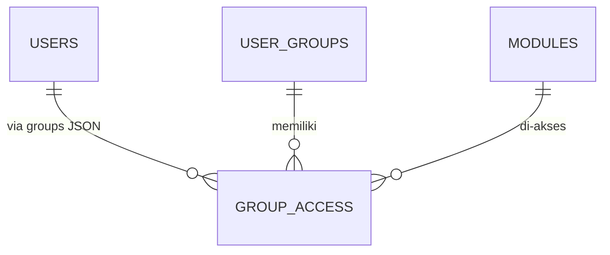

# Buku Kedua

## Fase 1 — Fondasi Aplikasi BK SMANSAKA

*Langkah demi langkah membangun fondasi aplikasi:
scaffold Laravel, setup Inertia+React, tema teal, login, RBAC, dan seeder.*

---

**Disusun oleh:** Tim Pengembang SMANSAKA
**Tanggal:** 22 April 2026
**Status fase:** ✅ **SELESAI**

---

## Daftar Isi

1. [Ringkasan Fase 1](#1-ringkasan-fase-1)
2. [Prasyarat Lingkungan](#2-prasyarat-lingkungan)
3. [Langkah 1 — Scaffold Laravel 13](#3-langkah-1--scaffold-laravel-13)
4. [Langkah 2 — Konfigurasi `.env` & Database](#4-langkah-2--konfigurasi-env--database)
5. [Langkah 3 — Install Composer Packages](#5-langkah-3--install-composer-packages)
6. [Langkah 4 — Install NPM Packages](#6-langkah-4--install-npm-packages)
7. [Langkah 5 — Tailwind 4 + Palet Teal](#7-langkah-5--tailwind-4--palet-teal)
8. [Langkah 6 — TypeScript + Vite + React](#8-langkah-6--typescript--vite--react)
9. [Langkah 7 — Migrasi & Struktur Tabel Inti](#9-langkah-7--migrasi--struktur-tabel-inti)
10. [Langkah 8 — Models (Eloquent)](#10-langkah-8--models-eloquent)
11. [Langkah 9 — Inertia Middleware & Blade Root](#11-langkah-9--inertia-middleware--blade-root)
12. [Langkah 10 — RBAC: `CheckModuleAccess`](#12-langkah-10--rbac-checkmoduleaccess)
13. [Langkah 11 — Auth (Login via Username)](#13-langkah-11--auth-login-via-username)
14. [Langkah 12 — Layout Inertia (Guest & Authenticated)](#14-langkah-12--layout-inertia-guest--authenticated)
15. [Langkah 13 — Halaman (Welcome, Login, Dashboard)](#15-langkah-13--halaman-welcome-login-dashboard)
16. [Langkah 14 — Seeder (Admin, Grup, Modul, Akses)](#16-langkah-14--seeder-admin-grup-modul-akses)
17. [Langkah 15 — PWA (Manifest + Service Worker)](#17-langkah-15--pwa-manifest--service-worker)
18. [Langkah 16 — Build & Smoke Test](#18-langkah-16--build--smoke-test)
19. [Akun Default](#19-akun-default)
20. [Struktur Folder Hasil](#20-struktur-folder-hasil)
21. [Ke Mana Selanjutnya?](#21-ke-mana-selanjutnya)

---

## 1. Ringkasan Fase 1

Target Fase 1 (Fondasi) adalah membangun **kerangka aplikasi**: struktur Laravel,
stack frontend modern, sistem autentikasi, RBAC, dan layout yang siap dipakai oleh
semua modul selanjutnya. Selesainya fase ini ditandai dengan:

- ✅ Laravel 13 terinstall, Composer packages tersambung.
- ✅ React 19 + TypeScript 5 + Inertia 3 + Tailwind 4 jalan via Vite 8.
- ✅ Database MySQL `smansaka_bk` terinisialisasi dengan 6 tabel inti + Spatie.
- ✅ Login via **username** berfungsi (akun admin, koordinator, 3 guru BK, kepsek).
- ✅ RBAC `CheckModuleAccess` siap dipakai di route.
- ✅ Layout sidebar + topbar + login split-layout dengan tema teal SMANSAKA.
- ✅ PWA manifest + service worker aktif.
- ✅ `npm run build` sukses, halaman utama HTTP 200.

Total file dibuat: **30+ file**, termasuk 7 migrasi, 6 model, 2 middleware,
3 halaman React, 2 layout, 6 seeder, dan konfigurasi.

---

## 2. Prasyarat Lingkungan

Versi yang dipakai dalam pembuatan aplikasi ini:

| Tools | Versi | Catatan |
|-------|-------|---------|
| PHP | 8.3.30 NTS | `c:/laragon/bin/php/php-8.3.30-nts-Win32-vs16-x64` |
| Composer | 2.4.1 | `c:/laragon/bin/composer/composer.phar` |
| Node.js | 24.14.0 | `c:/laragon/bin/nodejs/node-v24.14.0-win-x64` |
| npm | 11.9.0 | bundled dengan Node |
| MySQL | 8.0.30 | Laragon default |
| OS | Windows 11 | via Laragon + bash/Git Bash |

### Setup PATH (Git Bash)

```bash
export PATH="/c/laragon/bin/php/php-8.3.30-nts-Win32-vs16-x64:$PATH"
export PATH="/c/laragon/bin/nodejs/node-v24.14.0-win-x64:$PATH"
```

---

## 3. Langkah 1 — Scaffold Laravel 13

Karena folder `smansaka-bk/` sudah berisi `CLAUDE.md` dan `doc/`, kita **pindahkan
dulu** supaya Composer bisa scaffold di folder kosong.

```bash
# Backup file non-Laravel
mv /c/laragon/www/smansaka-bk/CLAUDE.md /c/laragon/www/_backup/
mv /c/laragon/www/smansaka-bk/doc /c/laragon/www/_backup/

# Install Laravel 13
composer create-project laravel/laravel:^13.0 . --prefer-dist --no-interaction

# Kembalikan
mv /c/laragon/www/_backup/CLAUDE.md /c/laragon/www/smansaka-bk/
mv /c/laragon/www/_backup/doc /c/laragon/www/smansaka-bk/
```

Hasil: struktur standar Laravel 13 (`app/`, `bootstrap/`, `config/`, `database/`,
`public/`, `resources/`, `routes/`, dst.) + file kita tetap utuh.

---

## 4. Langkah 2 — Konfigurasi `.env` & Database

### Buat database

```bash
mysql -u root -e "CREATE DATABASE IF NOT EXISTS smansaka_bk
  CHARACTER SET utf8mb4 COLLATE utf8mb4_unicode_ci;"
```

### Edit `.env`

Kunci yang kita ubah dari default:

```env
APP_NAME="BK SMANSAKA"
APP_URL=http://smansaka-bk.test
APP_TIMEZONE="Asia/Jakarta"
APP_LOCALE=id
APP_FALLBACK_LOCALE=id
APP_FAKER_LOCALE=id_ID

DB_CONNECTION=mysql
DB_HOST=127.0.0.1
DB_PORT=3306
DB_DATABASE=smansaka_bk
DB_USERNAME=root
DB_PASSWORD=

FILESYSTEM_DISK=public
MAIL_FROM_ADDRESS="bk@sman1kabanjahe.sch.id"
```

---

## 5. Langkah 3 — Install Composer Packages

```bash
php composer.phar require \
    inertiajs/inertia-laravel \
    tightenco/ziggy \
    spatie/laravel-activitylog \
    spatie/laravel-medialibrary \
    barryvdh/laravel-dompdf \
    maatwebsite/excel \
    laravel/sanctum
```

| Package | Fungsi |
|---------|--------|
| `inertiajs/inertia-laravel` | Bridge Inertia ↔ Laravel |
| `tightenco/ziggy` | Route helper di sisi JavaScript |
| `spatie/laravel-activitylog` | Audit trail otomatis (lebih mature daripada log custom) |
| `spatie/laravel-medialibrary` | Upload file + thumbnail otomatis |
| `barryvdh/laravel-dompdf` | PDF (berita acara, laporan) |
| `maatwebsite/excel` | Import Excel (data siswa) + export |
| `laravel/sanctum` | API token untuk integrasi antar aplikasi SMANSAKA |

---

## 6. Langkah 4 — Install NPM Packages

```bash
# Core stack
npm install --save-dev \
    @inertiajs/react react@^19 react-dom@^19 \
    @types/react @types/react-dom @types/node \
    typescript@^5 @vitejs/plugin-react

# Utilitas UI (shadcn pattern)
npm install \
    lucide-react \
    @tanstack/react-table \
    react-hook-form zod @hookform/resolvers \
    sonner recharts date-fns signature_pad \
    clsx tailwind-merge class-variance-authority \
    axios

# Radix UI primitives
npm install \
    @radix-ui/react-dialog \
    @radix-ui/react-dropdown-menu \
    @radix-ui/react-label \
    @radix-ui/react-slot \
    @radix-ui/react-checkbox \
    @radix-ui/react-select \
    @radix-ui/react-tooltip \
    @radix-ui/react-popover
```

### Apa saja yang terinstall?

| Paket | Kegunaan |
|-------|----------|
| `react`, `react-dom` 19 | UI library |
| `@inertiajs/react` | Inertia adapter |
| `typescript` | Type safety |
| `lucide-react` | Ikon modern (dipakai di sidebar & halaman) |
| `@tanstack/react-table` | Tabel profesional (fase berikutnya) |
| `react-hook-form` + `zod` | Form + validasi |
| `sonner` | Toast notification |
| `recharts` | Chart dashboard |
| `date-fns` | Format tanggal ID |
| `signature_pad` | Tanda tangan digital (home visit) |
| `clsx` + `tailwind-merge` + `cva` | Helper untuk variant komponen |
| `@radix-ui/*` | Primitif aksesibel (Dialog, Dropdown, dll) |

---

## 7. Langkah 5 — Tailwind 4 + Palet Teal

Tailwind 4 memakai pendekatan **CSS-first config** dengan directive `@theme`.
Tidak perlu lagi `tailwind.config.js` rumit.

### `resources/css/app.css`

```css
@import 'tailwindcss';

@source '../**/*.blade.php';
@source '../**/*.tsx';
@source '../**/*.ts';

@theme {
    --font-sans: 'Inter', ui-sans-serif, system-ui, sans-serif;

    --color-primary-50:  #eefbfc;
    --color-primary-100: #d5f4f7;
    --color-primary-400: #3bb8cc;
    --color-primary-500: #1f9db1;
    --color-primary-600: #117481;   /* warna utama */
    --color-primary-700: #145f6b;
    --color-primary-900: #19414b;
    /* ... (palet lengkap di file) */
}
```

Cara pakai di komponen React:

```tsx
<button className="bg-primary-600 hover:bg-primary-700 text-white">
    Masuk
</button>
```

---

## 8. Langkah 6 — TypeScript + Vite + React

### `tsconfig.json`

- Target ES2022
- JSX: `react-jsx`
- Strict mode aktif
- Path alias `@/*` → `resources/js/*`

### `vite.config.js`

```js
import react from '@vitejs/plugin-react';
import tailwindcss from '@tailwindcss/vite';

export default defineConfig({
    plugins: [
        laravel({
            input: ['resources/css/app.css', 'resources/js/app.tsx'],
            refresh: true,
        }),
        react(),
        tailwindcss(),
    ],
    resolve: {
        alias: {
            '@': path.resolve(process.cwd(), 'resources/js'),
            ziggy: path.resolve(process.cwd(), 'vendor/tightenco/ziggy'),
        },
    },
});
```

---

## 9. Langkah 7 — Migrasi & Struktur Tabel Inti

Dibuat **7 migrasi** (termasuk users default). Jalankan:

```bash
php artisan migrate:fresh --seed
```

### Tabel yang dibuat

| Tabel | Kolom penting |
|-------|---------------|
| `users` | `username` (unik), `name`, `password`, `photo`, `position`, `phone`, `groups` (JSON), `is_active`, `last_login_at` |
| `user_groups` | `name`, `slug`, `description`, `is_system` |
| `modules` | `name`, `slug`, `icon`, `parent_slug`, `sort_order` |
| `group_access` | `group_id`, `module_id`, `can_read`, `can_write` |
| `settings` | `key`, `value`, `group`, `type`, `label` |
| `academic_years` | `year`, `start_date`, `end_date`, `semester`, `is_active` |
| `activity_log` | (dari Spatie) audit trail |
| `media` | (dari Spatie Media Library) |

### Relasi singkat



---

## 10. Langkah 8 — Models (Eloquent)

Enam model Eloquent dibuat di `app/Models/`:

### `User.php` (disesuaikan)

Kunci utama:

- `HasApiTokens` dari Sanctum
- `LogsActivity` dari Spatie
- `SoftDeletes`
- Method `hasModuleAccess($slug, 'read'|'write')` → cek izin
- Method `getPermissionsMap()` → cached map `{ slug => {read, write} }`
- Method `isSuperAdmin()` → true jika id=1
- Cache permissions di `Cache::remember("user.{id}.permissions", 15 menit)`

```php
public function hasModuleAccess(string $moduleSlug, string $ability = 'read'): bool
{
    if ($this->isSuperAdmin()) return true;
    $perms = $this->getPermissionsMap();
    $modulePerms = $perms[$moduleSlug] ?? null;
    if (! $modulePerms) return false;
    return match ($ability) {
        'read' => (bool) $modulePerms['read'],
        'write' => (bool) $modulePerms['write'],
    };
}
```

### `UserGroup.php`, `Module.php`, `GroupAccess.php`

Sederhana — relasi Eloquent standar. `GroupAccess` memakai nama tabel eksplisit
`$table = 'group_access'` karena Laravel otomatis menjamakkan jadi `group_accesses`.

### `Setting.php`

Punya helper static `Setting::get($key, $default)` dan `Setting::set($key, $value, $type)`
yang otomatis memakai **cache forever**. Cache dibersihkan di event `saved` & `deleted`.

### `AcademicYear.php`

Punya static `AcademicYear::active()` → mengambil tahun ajaran aktif.

---

## 11. Langkah 9 — Inertia Middleware & Blade Root

### `app/Http/Middleware/HandleInertiaRequests.php`

Ini yang **share props** ke semua halaman React:

| Prop | Isi |
|------|-----|
| `auth.user` | Data user yang login |
| `permissions` | Map modul → `{read, write}` (untuk enable/disable menu) |
| `branding` | Dari tabel `settings` (`site_name`, `logo`, `favicon`) |
| `academic_year` | Tahun ajaran aktif |
| `ziggy` | Route helper |
| `flash` | Flash message (success/error/info) |

### `resources/views/app.blade.php`

Template root Inertia. Include:
- Favicon, PWA manifest, theme-color teal
- Font Inter dari bunny.net
- `@routes` (Ziggy)
- `@vite(['resources/css/app.css', 'resources/js/app.tsx', ...])`
- `@inertiaHead` + `@inertia`

### `bootstrap/app.php`

```php
->withMiddleware(function (Middleware $middleware): void {
    $middleware->web(append: [
        HandleInertiaRequests::class,
        AddLinkHeadersForPreloadedAssets::class,
    ]);

    $middleware->alias([
        'module' => CheckModuleAccess::class,
    ]);
})
```

---

## 12. Langkah 10 — RBAC: `CheckModuleAccess`

Middleware untuk proteksi route berbasis modul + ability.

### Cara pakai di `routes/web.php`

```php
Route::get('dashboard', [DashboardController::class, 'index'])
    ->middleware('module:dashboard,read')
    ->name('dashboard');

Route::post('students', [StudentController::class, 'store'])
    ->middleware('module:students,write');
```

### Logika middleware

```php
public function handle(Request $request, Closure $next, string $module, string $ability = 'read')
{
    $user = $request->user();
    if (! $user) return redirect()->route('login');

    if ($user->id === 1) return $next($request); // super admin

    if (! $user->hasModuleAccess($module, $ability)) {
        abort(403, 'Anda tidak memiliki akses ke modul ini.');
    }

    return $next($request);
}
```

---

## 13. Langkah 11 — Auth (Login via Username)

### `LoginRequest.php`

Validasi + `authenticate()` method dengan **rate limit 5× per menit**:

```php
$credentials = [
    'username' => $this->input('username'),
    'password' => $this->input('password'),
    'is_active' => true,  // user nonaktif tidak bisa login
];

if (! Auth::attempt($credentials, $this->boolean('remember'))) {
    RateLimiter::hit($this->throttleKey());
    throw ValidationException::withMessages([
        'username' => __('Username atau password salah.'),
    ]);
}
```

### `LoginController.php`

3 method: `create` (form), `store` (proses), `destroy` (logout).

### Routes

```php
Route::middleware('guest')->group(function () {
    Route::get('login', [LoginController::class, 'create'])->name('login');
    Route::post('login', [LoginController::class, 'store']);
});

Route::post('logout', [LoginController::class, 'destroy'])
    ->middleware('auth')->name('logout');
```

---

## 14. Langkah 12 — Layout Inertia (Guest & Authenticated)

### `GuestLayout.tsx`

Layout split untuk halaman login:

- **Panel kiri** (hanya md+): gradient teal `primary-600 → primary-800`,
  logo, tagline, 4 fitur dengan ikon.
- **Panel kanan**: form dalam floating card `rounded-2xl shadow-xl`.
- Responsif: panel kiri disembunyikan di mobile, brand kecil muncul di atas form.

### `AuthenticatedLayout.tsx`

Layout utama dengan sidebar + topbar:

- **Sidebar 288px** (w-72): brand card gradient di atas, navigation
  dengan sub-menu collapsible, dibawah ada tombol Keluar.
- **Topbar**: menu mobile, breadcrumbs, badge tahun ajaran, dropdown profil.
- **Konten utama**: header section opsional + `<main>`.
- **Visibility check**: setiap nav item punya `permission` — disembunyikan otomatis
  jika user tidak punya akses.

---

## 15. Langkah 13 — Halaman (Welcome, Login, Dashboard)

### `Pages/Welcome.tsx`

Landing publik dengan hero, 6 feature card (modul utama), footer.

### `Pages/Auth/Login.tsx`

Form login memakai `useForm` dari Inertia:

- Field username + password (toggle show/hide dengan `Eye`/`EyeOff` dari lucide)
- Checkbox "Ingat saya"
- Rate-limit error message dari backend
- Auto-reset password on finish

### `Pages/Dashboard.tsx`

4 stat card (Siswa Asuh, Kasus Aktif, Konseling, Home Visit) — placeholder 0,
ditambah panel "Fase 1: Fondasi ✅" berisi checklist pencapaian.

---

## 16. Langkah 14 — Seeder (Admin, Grup, Modul, Akses)

Enam seeder urutan:

1. **`ModuleSeeder`** — 21 modul (Dashboard, Siswa, Kelas, Konseling, Kasus, Instrumen, Program, Laporan, Sistem).
2. **`UserGroupSeeder`** — 5 grup: Super Admin, Koordinator BK, Guru BK, Wali Kelas, Kepala Sekolah.
3. **`GroupAccessSeeder`** — matriks RBAC (lihat bab 5 buku 1).
4. **`UserSeeder`** — 6 user default (lihat akun di bab 19).
5. **`SettingSeeder`** — nama aplikasi, nama sekolah, logo placeholder.
6. **`AcademicYearSeeder`** — TA 2026/2027 semester ganjil, aktif.

Jalankan:

```bash
php artisan migrate:fresh --seed
```

---

## 17. Langkah 15 — PWA (Manifest + Service Worker)

### `public/manifest.webmanifest`

```json
{
    "name": "Sistem Informasi Bimbingan & Konseling SMANSAKA",
    "short_name": "BK SMANSAKA",
    "start_url": "/dashboard",
    "display": "standalone",
    "background_color": "#f6f8f8",
    "theme_color": "#117481",
    "icons": [ /* 192 + 512 */ ]
}
```

### `public/sw.js`

Strategi:
- **Cache-first** untuk asset (CSS, JS, gambar)
- **Network-first** untuk halaman HTML (fallback ke cache kalau offline)
- **Skip** request Inertia (`X-Inertia` header), API, dan `/build/*` dev server.

### Registrasi

File `resources/js/lib/registerSW.ts` dipanggil di `app.tsx`, hanya aktif saat
`import.meta.env.DEV === false` (jangan register di dev).

---

## 18. Langkah 16 — Build & Smoke Test

### Build

```bash
npm run build
```

Hasil:

```
public/build/assets/app-BCa_mHwn.css        57.60 kB │ gzip: 12.01 kB
public/build/assets/app-B1joPDGo.js         382.22 kB │ gzip: 121.29 kB
public/build/assets/Welcome-DCZ2MUuu.js      4.83 kB │ gzip:  1.76 kB
public/build/assets/Login-DOlelT4n.js        7.39 kB │ gzip:  2.68 kB
public/build/assets/Dashboard-BKlZe1Jq.js   16.22 kB │ gzip:  5.04 kB
✓ built in 20.60s
```

### Smoke Test

```bash
php artisan serve --host=127.0.0.1 --port=8765 &
curl -w "HTTP %{http_code}\n" http://127.0.0.1:8765/       # → HTTP 200
curl -w "HTTP %{http_code}\n" http://127.0.0.1:8765/login  # → HTTP 200
```

✅ Aset Vite terload, Inertia data-page terinjeksi, Ziggy routes available.

---

## 19. Akun Default

> ⚠️ **GANTI password semua akun ini saat production deploy.**

| Peran | Username | Password |
|-------|----------|----------|
| Super Admin | `admin` | `admin12345` |
| Koordinator BK | `koorbk` | `koorbk12345` |
| Guru BK 1 | `gurubk1` | `gurubk1` |
| Guru BK 2 | `gurubk2` | `gurubk2` |
| Guru BK 3 | `gurubk3` | `gurubk3` |
| Kepala Sekolah | `kepsek` | `kepsek12345` |

---

## 20. Struktur Folder Hasil

```
smansaka-bk/
├── app/
│   ├── Http/
│   │   ├── Controllers/
│   │   │   ├── Auth/LoginController.php
│   │   │   └── DashboardController.php
│   │   ├── Middleware/
│   │   │   ├── HandleInertiaRequests.php
│   │   │   └── CheckModuleAccess.php
│   │   └── Requests/Auth/LoginRequest.php
│   └── Models/
│       ├── User.php           ← extended
│       ├── UserGroup.php
│       ├── Module.php
│       ├── GroupAccess.php
│       ├── Setting.php
│       └── AcademicYear.php
├── bootstrap/app.php          ← Inertia middleware + module alias
├── database/
│   ├── migrations/            ← 10+ migrasi (incl. Spatie)
│   └── seeders/               ← 6 seeder
├── doc/                       ← folder dokumentasi (buku ini)
├── public/
│   ├── manifest.webmanifest
│   ├── sw.js
│   └── build/                 ← hasil vite build
├── resources/
│   ├── css/app.css            ← Tailwind 4 + palet teal
│   ├── js/
│   │   ├── app.tsx            ← Inertia entry
│   │   ├── bootstrap.ts
│   │   ├── Components/
│   │   │   ├── ApplicationLogo.tsx
│   │   │   └── ui/            ← Button, Input, Label, InputError
│   │   ├── Layouts/
│   │   │   ├── GuestLayout.tsx
│   │   │   └── AuthenticatedLayout.tsx
│   │   ├── Pages/
│   │   │   ├── Welcome.tsx
│   │   │   ├── Auth/Login.tsx
│   │   │   └── Dashboard.tsx
│   │   ├── lib/
│   │   │   ├── utils.ts       ← cn(), formatDateID(), initials()
│   │   │   └── registerSW.ts
│   │   └── types/             ← definisi PageProps, global
│   └── views/app.blade.php    ← root Inertia
├── routes/web.php             ← welcome, login, logout, dashboard
├── tsconfig.json
├── vite.config.js
├── .env                       ← MySQL smansaka_bk
├── CLAUDE.md
└── package.json
```

---

## 21. Ke Mana Selanjutnya?

Fase 1 sudah menyediakan **pondasi**. Tahap berikutnya sesuai roadmap:

- **Buku 3 — Fase 2: Master Data**
  CRUD Siswa (manual + import Excel), Kelas, Wali Kelas, Orang Tua, Guru BK,
  assignment siswa asuh.

- **Buku 4 — Fase 3: Buku Kasus & Poin Pelanggaran**
  Catatan kasus multi-kategori, workflow penanganan, akumulasi poin + escalation.

- **Buku 5 — Fase 4: Layanan BK**
  Konseling individual (rahasia), kelompok, klasikal, home visit + tanda tangan + PDF.

- **Buku 6 — Fase 5: Instrumen** (AKPD, DCM, Sosiometri, Minat Bakat).

- **Buku 7 — Fase 6: Program, Laporan, Analitik**.

Untuk memulai Fase 2, jalankan aplikasi via Laragon lalu akses:

```
http://smansaka-bk.test/
```

Atau via PHP serve:

```bash
php artisan serve
# → http://localhost:8000
```

Login dengan `admin` / `admin12345`, lalu eksplorasi sidebar. Semua menu sudah
di-render tapi belum ada konten — itulah yang akan kita isi di Fase 2.

---

*Selesai Buku Kedua.*
